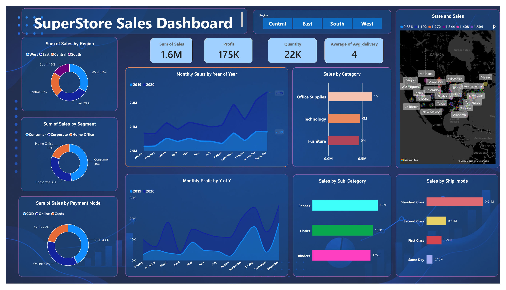
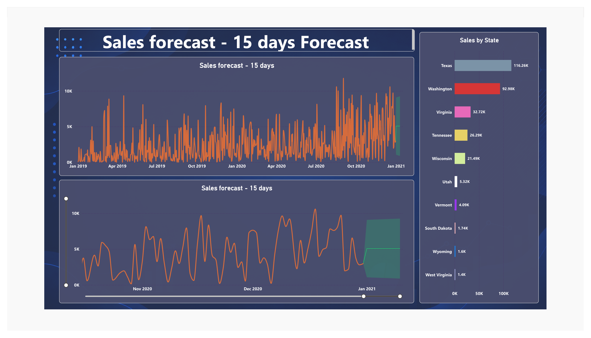

# 📊 SuperStore Sales Dashboard

> An interactive Power BI Sales Analytics Dashboard built to analyze SuperStore sales, profit, customers, products, shipping modes, payment methods, regions, states, and sales trends.

---

## 📌 Project Overview

This project uses the SuperStore sales dataset to transform sales data into an interactive Power BI dashboard.

The dashboard provides a high-level view of business performance and helps identify important sales and profitability patterns across different categories, regions, segments, payment modes, shipping modes, states, and time periods.

---

## 🛠️ Tools Used

- **Power BI** — Dashboard and data visualization
- **Power Query** — Data preparation and transformation
- **DAX** — Measures and calculations
- **Excel / CSV** — Source dataset
- **GitHub** — Project hosting and documentation

---

## 📂 Project Files

| File | Description |
|---|---|
| `SuperStore_Sales_Dataset.csv` | SuperStore sales dataset |
| `SuperStore_Sales_DataSet.xlsx` | Excel version of the dataset |
| `SuperStore_Sales_Dashboard.pbix` | Power BI dashboard file |
| `dashboard-page-1.png` | Main dashboard screenshot |
| `dashboard-page-2.png` | Sales forecast and state analysis screenshot |

---

## 📊 Dashboard KPIs

| KPI | Value |
|---|---:|
| 💰 Total Sales | **1.6M** |
| 📦 Total Quantity | **22K** |
| 💵 Total Profit | **175K** |
| 🚚 Average Delivery | **4 Days** |

---

## 📈 Dashboard Analysis

### 🛍️ Sales by Category

The dashboard compares sales across:

- Office Supplies
- Technology
- Furniture

### 📦 Sales by Sub-Category

Key sub-categories highlighted in the dashboard include:

- Phones
- Chairs
- Binders

### 🚚 Sales by Shipping Mode

Sales are analyzed across:

- Standard Class
- Second Class
- First Class
- Same Day

### 📅 Monthly Sales Analysis

The dashboard tracks monthly sales for **2019 and 2020**, allowing year-over-year trend analysis from January through December.

### 💰 Monthly Profit Analysis

Monthly profit is analyzed for **2019 and 2020** to understand changes in profitability over time.

### 👥 Sales by Segment

| Segment | Sales Share |
|---|---:|
| Consumer | **48%** |
| Corporate | **33%** |
| Home Office | **19%** |

### 💳 Sales by Payment Mode

| Payment Mode | Sales Share |
|---|---:|
| COD | **43%** |
| Online | **35%** |
| Cards | **22%** |

### 🌎 Sales by Region

| Region | Sales Share |
|---|---:|
| West | **33%** |
| East | **29%** |
| Central | **22%** |
| South | **16%** |

### 🗺️ State-wise Sales

The dashboard provides state-level sales analysis, including states such as:

- Texas
- Washington
- Virginia
- Tennessee
- Wisconsin
- Utah
- Vermont
- South Dakota
- Wyoming
- West Virginia

### 🔮 Sales Forecast

The dashboard includes a **15-day sales forecast**, providing a forward-looking view of expected sales performance.

---

## 🖼️ Dashboard Screenshots

### Page 1 — Sales Dashboard



### Page 2 — Forecast & State Analysis



---

## 💡 Key Insights

- 🥇 **West** is the largest region by sales contribution at **33%**.
- 👥 **Consumer** is the largest customer segment at **48%**.
- 💳 **COD** is the largest payment mode at **43%**.
- 🚚 **Standard Class** is the largest shipping mode by sales.
- 💰 Total sales are approximately **1.6M**.
- 📈 Total profit is approximately **175K**.
- 📦 Total quantity is approximately **22K**.
- 🔮 The dashboard includes historical sales analysis and a **15-day sales forecast**.

---

## 🎯 Business Questions Answered

This dashboard helps answer:

1. What is the total sales and profit?
2. Which category generates the most sales?
3. Which sub-categories perform strongly?
4. Which shipping mode contributes the most sales?
5. Which customer segment contributes the most revenue?
6. Which payment mode is used most?
7. Which region generates the highest sales?
8. How do sales change month by month?
9. How does monthly profit change over time?
10. Which states contribute significantly to sales?
11. What does the short-term sales forecast indicate?

---

## 🔄 Analytics Workflow

```text
Raw Dataset
     ↓
Data Preparation
     ↓
Power Query
     ↓
Data Modeling
     ↓
DAX Measures
     ↓
Interactive Visualizations
     ↓
Power BI Dashboard
     ↓
Business Insights & Forecast
```

---

## 🚀 How to Use

### Open the Power BI Dashboard

1. Download `SuperStore_Sales_Dashboard.pbix`.
2. Install **Microsoft Power BI Desktop**.
3. Open the `.pbix` file.
4. Refresh the data if required.
5. Use the dashboard visuals and filters to explore the analysis.

### Explore the Dataset

The dataset is available in:

- CSV format
- Excel format

You can open either file using Microsoft Excel or another data-analysis tool.

---

## 📚 Skills Demonstrated

- Data Cleaning
- Data Transformation
- Data Modeling
- Power Query
- DAX
- KPI Development
- Data Visualization
- Sales Analytics
- Profit Analysis
- Customer Segmentation
- Regional Analysis
- Forecasting
- Business Intelligence

---

## 👨‍💻 Author

### Aprupinath Singh

🎓 **BE Computer Engineering**  
📊 **Data Analytics & Business Intelligence Enthusiast**

🔗 **GitHub:** [@aprupisingh](https://github.com/aprupisingh)

---

## ⭐ Project

If you find this project useful, consider giving the repository a ⭐ on GitHub.
